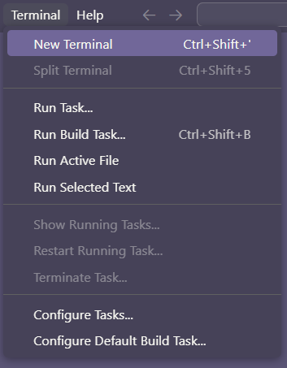
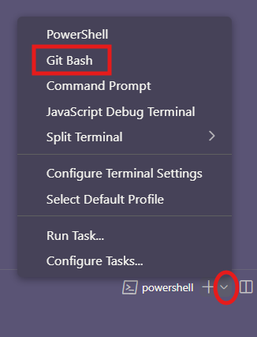
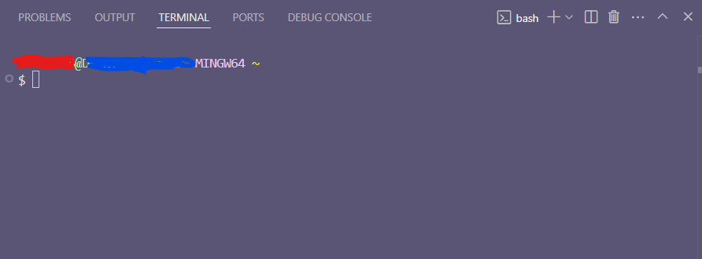
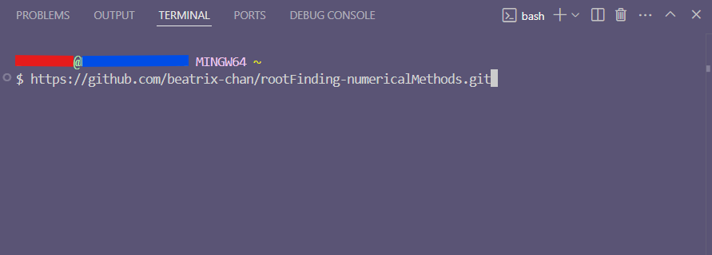
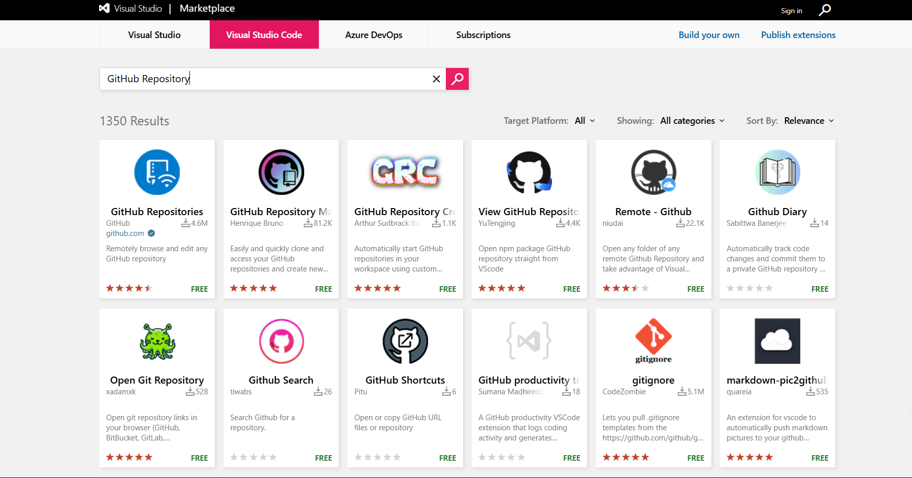
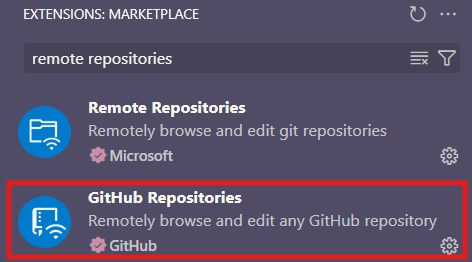
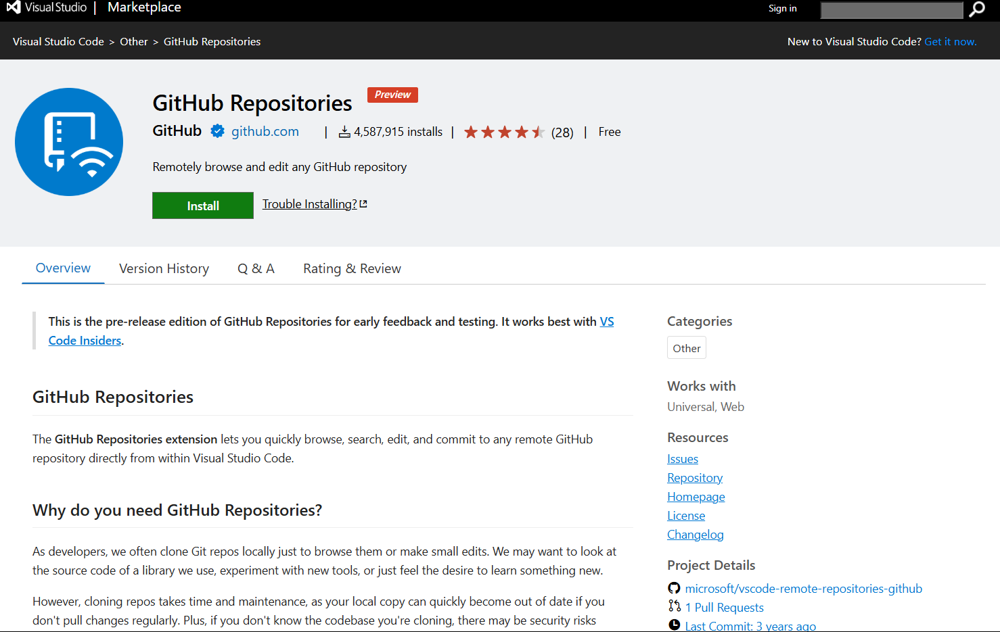
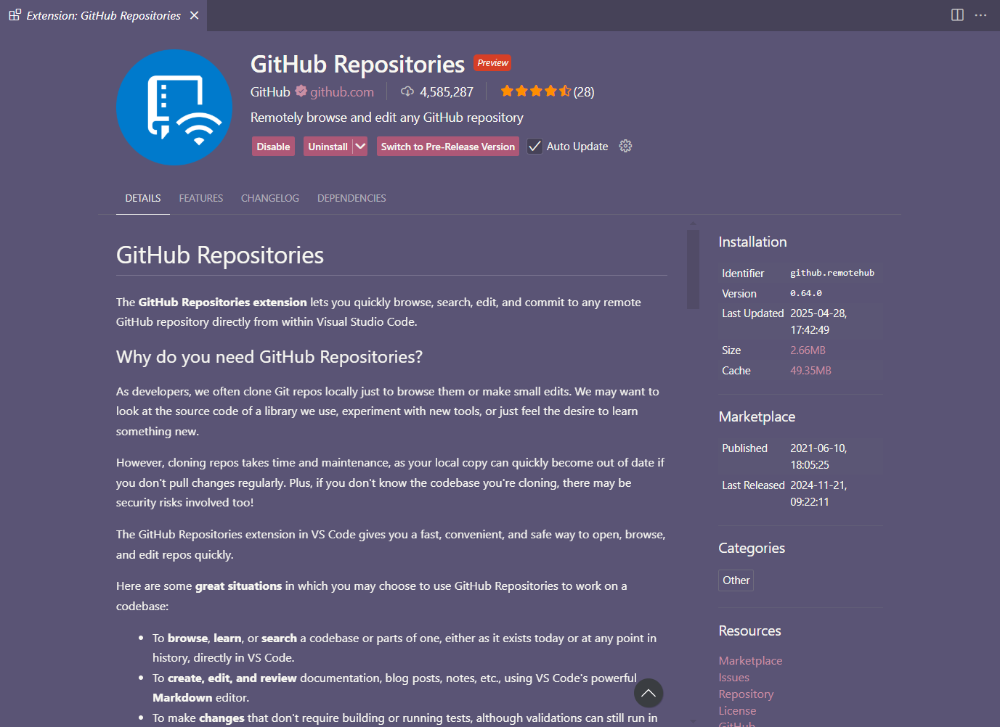
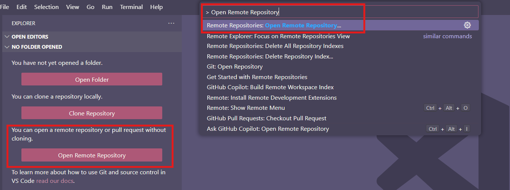
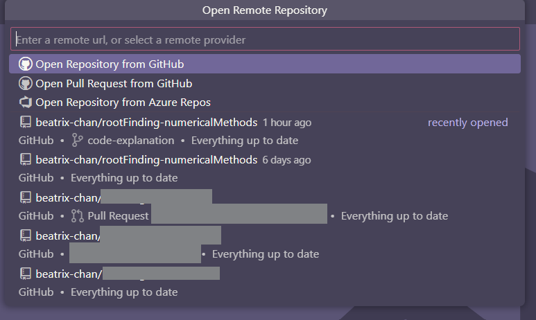

# Bash Guide

> [!NOTE]
> This guide goes through how to clone this repository using a bash terminal (git). I recommend to read everything **within** just because of text formatting and everything (I am used to using [mystmd](https://mystmd.org) and [myst-parser](https://myst-parser.readthedocs.io/en/latest/) but I intentionally switched to use [GitHub Flavoured Markdown](https://github.github.com/gfm/) for this)

> [!CAUTION]
> If you want to submit a pull request (PR), please fork the repository and create a new branch to edit, then commit and push! You can read more about [Collaborating with pull request](https://docs.github.com/en/pull-requests/collaborating-with-pull-requests) and [Working with forks](https://docs.github.com/en/pull-requests/collaborating-with-pull-requests/working-with-forks) from GitHub's docs.

[](https://github.com/git-guides/)

## GitHub Desktop
[](https://docs.github.com/en/desktop) [](https://desktop.github.com/release-note/) [](https://desktop.github.com/download/)

GitHub claimed the easiest way is to install [GitHub Desktop](https://github.com/apps/desktop) which will install Git along. Read more about [Coloning and forking repositories from GitHub Desktop](https://docs.github.com/en/desktop/adding-and-cloning-repositories/cloning-and-forking-repositories-from-github-desktop) in GitHub's docs.

## Command Prompt

1. Visit Git's Download page and install the latest version.<br />[](https://git-scm.com/downloads)

<details>
  <summary>Or use one of these methods depending on your system!</summary>

  **Windows** <br />
  *Alternative*: [](https://gitforwindows.org/)

  **Mac** <br />
  [](https://formulae.brew.sh/formula/git#default)
  ```bash
  brew install git
  ```

  **Linux (Ubuntu/Debian)** <br />
  ```bash
  sudo apt update
  sudo apt upgrade -y
  sudo apt install git-all
  ```

  **Linux (Fedora)** <br />
  ```bash
  sudo dnf update
  sudo dnf upgrade
  sudo dnf install git-all
  ```

  **Linux (CentOS/RHEL)** <br />
  ```bash
  sudo yum update
  sudo yum upgrade
  sudo yum install git-all
  ```
</details>

> The latest version as of I'm making this guide for Git is 2.49.0

2. *If downloaded from git's website* Activate the installation application and following the instruction from git setup wizard until installation is completed.
3. Go to `Git Bash` and type the following line to verify your installation
```bash
git --version
```
4. In `Git Bash`, add the following line, which will clone this repository
> [!WARNING]
> Note that if you do `git clone` immediately without choosing a specific folder, you will waste time to dig through your C drive! Otherwise, for Windows 11, you can go to the folder you want to clone this repository to, right click at an empty area, choose `Show more options`, then choose `Open Git Bash here`. It should open `Git Bash` terminal, then you can clone it and save your folder in there. For Windows 10, you should be able to see `Open Git Bash here` as soon as you right click.  

```bash
git clone https://github.com/beatrix-chan/rootFinding-numericalMethods.git
```

## Visual Studio Code

> This works the same in [Visual Studio Code Insiders](https://code.visualstudio.com/insiders/) too! 

## Git Bash
1. Go to the `Terminal` tab, and choose `New Terminal`.

2. For Windows, the default terminal will be Powershell, click the dropdown icon and choose `git bash` from the drop-up menu. (MacOS and Linux might default to `bash` terminal already, do this only if it doesn't)

3. For Windows, you can click the garbage bin icon next to the Powershell terminal at the list beside to kill it (if you feel bothered). Otherwise, you will see something like `username@computer-name MINGW64 ~$` in your git bash terminal.

4. Add `git clone https://github.com/beatrix-chan/rootFinding-numericalMethods.git` afterwards and it will start cloning to your workspace.


> If you want to submit a pull request this way, check out [Pat's guide on Youtube](https://www.youtube.com/watch?v=For9VtrQx58)! This is an excellent guide.

## Remote Repository
> [!IMPORTANT]
> **Prerequiste**:
> Forked repository to your own GitHub.

1. Install the extensions.
| [Marketplace](https://marketplace.visualstudio.com/vscode) | `Extensions` from Navigation bar |
| :--------------------------------------------------------: | :------------------------------: |
|  |  |
|  |  |
|  |  |

2. Open Command Prompt and search for `> Open Remote Repository` or just click that button from `Explorer`.

3. You should then be able to see a list of repositories that are in your GitHub. Choose the one you have forked!

