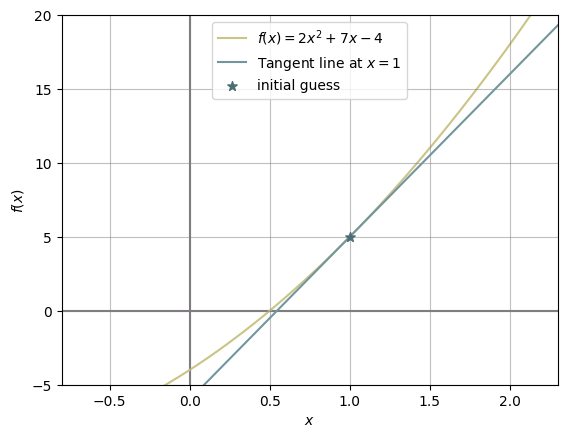

# Code Explanation

<details>

<summary>Table of Contents</summary>

1. [Implementations](#1-implementations)
2. [Trace Tables](#2-trace-tables)
3. [Comparison Table](#3-comparison-table)
4. [Plots of Convergence](#4-plots-of-convergence)

> This came out more words than I have expected I'm sorry ;-;

</details>

> [!IMPORTANT]
> Put the methods (the `.py` files) in the **same** folder as where you run the codes. I am only seperating them into the [implementations](/implementations/) folder so they can be searched and downloaded/copied easily.

> [!NOTE]
> Here is a quick recap of what was mentioned in [theories.md](theories.md)
> 
> | Methods | Approximation Algorithm | Iteration formula |
> | :-----: | :---------------------- | :---------------: |
> | Bisection Method | Halves an interval over and over again | $$c = \frac{a + b}{2}$$ |
> | Newton-Raphson Method | Uses the tangent line to refine approximation | $$x_{n + 1} = x_{n} - \frac{f(x_{n})}{f'(x_{n})}$$ |
> | Secant Method | Uses secant line to refine approximation | $$x_{n + 1} = x_{n} - f(x_{n}) \times \frac{x_{n} - x_{n - 1}}{f(x_{n}) - f(x_{n - 1})}$$

> [!IMPORTANT]
> **ALWAYS** remember to add necessary libraries before starting to run your codes. Jupyter is very smart for storing variables but it will become a pain if bugs are in between.
> ```python
> import time # CPU times
> import numpy as np # Errors and Analysis
> import pandas as pd
> import matplotlib.pyplot as plt
> ```

---

## 1. Implementations

In this section, we will look at how to implement these three numerical methods. These are under the comment `# STANDARD --- Method Implementation` (replaced `---` with the methods' names).

> [!TIP]
> You can add those python sheets and implement in your experiment environment the same way you do with python functions (e.g. `time`, `numpy`, `pandas`, etc.), but you need to identify the source, then the function (just like importing the `Decimal` library.)
> ```python
> from bisection_method import bisection
> from newton_raphson_method import newton_raphson
> from secant_method import secant
> ```

### 1.1 Parameters

> [!TIP]
> At the beginning of every functions, there are a multi-line strings within a pair of triple quotes. They are called "docstrings" under [PEP 257](https://peps.python.org/pep-0257/#multi-line-docstrings). If you use Visual Studio Code (no matter the classic or developer version), you can hover your cursor above a function's name and see a small container underneath your cursor. The content of that container is the docstring! It's equivalent to using `<function>?` in Jupyter Notebook and `print(<function>.__doc__)` in python.

All methods also requires the input of `func`, which is the function you want to find the root for. An actual function in python must have the `return` keyword within it because that's an exit "command" and send a value back to the caller. Therefore, you cannot just put $f(x)$'s equation as an argument of a function. The line below shoulds the incorrect method:

```python
root, approximation = bisection(2 * x**2 + 7 * x - 4, -1, 1)
```

Instead, you should have a seperately define what your function is. Like this:

```python
def f(x):
    return 2 * x**2 + 7 * x - 4

root, approximation = bisection(f, -1, 1)
```

> [!CAUTION]
> Remember `return`!

> [!WARNING]
> And it's `f` not `f(x)` when it becomes a parameter of another function.

Other than `func`, the three of them also have common parameters `tol` and `max_iter`. The docstring sort of explain it already but just to expand on that slightly, their purpose is similar to machine epsilon ($\epsilon$) from Formative Assessment 1. `tol` is the predefined tolerance level to check for convergence, it specifies the maximum precision error allowed (because root approximations are stored as float, loosing precision). `max_iter` is used in the for loop outside the methods' iteration formula, which means the maximum number of times this formula can be used is 100 times not caring if convergent ever happened.

#### 1.1.1 Bisection Method

```python
def bisection(func, a, b, tol=1e-5, max_iter=100):
    """
    Perform the Bisection Method to find the root of a given function.

    Parameters:
        func (function): The function for which the root is to be found
        a (float): Left endpoint of the interval
        b (float): Right endpoint of the interval
        tol (float): Tolerance level for convergence
        max_iter (int): Maximum number of iteraions allowed
    """
```

The two remaining parameters required you to input are `a` and `b`. As explained in the docstrings, they are the left and right endpoints of the initial interval respectively.

> [!TIP]
> You have two choices to input `a` and `b` (both ways works):
>
> 1. Initialise variables
> ```python
> # Initialise variables
> a = 1
> b = 2
> 
> #Implement the Bisection Method
> root, midpoints = bisection(f, a, b)
> ```
> 2. Substitute as given input
> ```python
> # Implement the Bisection Method
> root, midpoints = bisection(f, 1, 2)
> ```
>
> I personally recommend *Method 2*, just so you can use `a` and `b` to collect `a_list` and `b_list` later for Trace Table if you decided to implement them in the same notebook. But it's really up to you how you want to do it. You can use literally anything to name your variables as long as it matches the sequence from the `return` line (e.g.: `return c, midpoints` then you must have 2 variables to recieve `c` and `midpoints`.)

#### 1.1.2 Newton-Raphson Method

```python
def newton_raphson(func, dfunc, x0, tol=1e-5, max_iter=100):
    """
    Perform the Newton-Raphson Method to find the root of a given function.

    Parameters:
        func (function): The function for which the root is to be found
        dfunc (function): The derivative of func
        x0 (float): Initial approximation
        tol (float): Tolerance level for convergence
        max_iter (int): Maximum number of iterations allowed
    """
```

`dfunc`:

After you defined `f`, it will be convenient to immediately define `df` as well. Same rule applies, add the keyword `return` before the function.

`x0`:

> [!IMPORTANT]
> In order to make your comparison fair, you should be aiming to approximate the **same** root for all methods. After you choose `a` and `b` (it will be better to not choose an interval that immediately results the exact root because no convergence can be observed, do something like $\pm 0.1$ or $\pm 0.2$), make your initial guess (`x0`) for Newton-Raphson Method the first midpoint (`c`) approximation from the Bisection Method. *Read the Important admonition at Secant Method for its correspondance variables.*

Unlike the Bisection Method where `a` and `b` do not count into the approximation list, `x0` do because in another words, it's your "initial guess". Therefore, the number of iterations and number of approximations are **not equal**.

> [!TIP]
> Same as the Bisection Method, you can initialise the variables in those two ways as well. But adding on to that, I suggest adding a prefix to variables that repeats for different methods because they can be overwritten if called again. Like if you put `root` for all three methods, Newton-Raphson's root will overwrite Bisection's, and Secant's will overwrite Newton-Raphson's. Do something like: `bisection_root`, `newton_root`, `secant_root`, etc.
> But they won't influence each other or crash into each other in their own `.py` files, because they are in seperated files.

#### 1.1.3 Secant Method

```python
def secant(func, x0, x1, tol=1e-5, max_iter=100):
    """Perform the Secant Method to find the root of a given function.

    Parameters:
        func (function): The function for which the root is to be found
        x0 (float): First initial approximation
        x1 (float): Second initial approximation
        tol (float): Tolerance level for convergence
        max_iter (int): Maximum number of iterations allowed
    """
```

The secant method's parameters look difficult (it is complicated if calculated by hand), but in terms of application, it's cheaper than the Newton-Raphson method and converges quicker than the Bisection Method.

`x0`, `x1`:

Although in the docstring `x0` is called the "first initial approximation", accurately speaking, it's actually the "previous approximation". If we look into Secant Method's iteration formula, there are three variables: $x_{n + 1}$, $x_{n}$, and $x_{n - 1}$, and it's corresponding to our variables `x2`, `x1`, `x0`. Therefore, you current approximation should be `x1`.

> [!IMPORTANT]
> We know how that `x1` is our current approximation, but in reality, it's actually impossible to get our "previous approximation". Making `x0`our first midpoint approximation from the Bisection Method neither is correct. So to make life easier. Just make `a` your `x0`, and `b` your `x1`.

### 1.2 Process

In this section, I will explain how each method works line by line.

#### 1.2.1 Bisection Method

```python
def bisection(func, a, b, tol=1e-5, max_iter=100):
    if func(a) * func(b) >= 0:
        raise ValueError("Function must have opposite signs at the endpoints.")

    midpoints = []

    for _ in range(max_iter):
        c = (a + b) / 2
        midpoints.append(c)

        if func(c) == 0 or abs(b - a) / 2 < tol:
            return c, midpoints
        elif func(a) * func(c) < 0:
            b = c
        else:
            a = c
    
    raise ValueError("Bisection method did not converge.")
```

The `raise ValueError`s might be new to you but they are not too complicated to understand. The first `raise ValueError` is in the `if` statement that checks if $f(a)$ and $f(b)$ has opposite signs by multiplying them together (because when a negative number multiplies a positive number, their product should be a negative number. If their product is equals to zero, first either $a$ and/or $b$ is/are the root(s) for the function, but at the same time it doesn't meet the requirement that they must be in opposite root in the function.) The code can be interpretated in another way like this:

```python
if func(a) * func(b) >= 0:
    raise ValueError("Function must have opposite signs at the endpoints.")
else:
    midpoints = []

    for _ in range(max_iter):
        # remaining implementation
```

For the second `raise ValueError` statement, it's dedicated for the `for` loop. This `raise ValueError` can be interpretated as in `else:` statement too (because `for` is recursive loop, it can be modified into iterative loop with `if`, but I'm not here to confuse you). This error will be raised if after `max_iter` iterations, `f(c)` still does not result in zero, and $|\frac{b - a}{2}|$ is still larger than tolerance level allowed. The purpose of this statement prevents infinite loops and a representation to indicate the method failed within the set tolerance.

```python
midpoints = []
```

This line initialise the variable `midpoints` as an empty list. This line shouldn't be added inside the `for` loop, otherwise the list resets every iteration.

```python
for _ in range(max_iter):
    c = (a + b) / 2
    midpoints.append(c)
```

Here, the `for` loop begins. Within the given range (`max_iter` in this case), perform the Bisection Method - add the two endpoints together and half the sum to get `c` (the midpoint of interval $\left [a, b\right ]$).

```python
    if func(c) == 0 or abs(b - a) / 2 < tol:
        return c, midpoints
    elif func(a) * func(c) < 0:
        b = c
    else:
        a = c
```

This part checks if `if` the root is found or not. If the statement `c` equals to `0` is `true` or if `c` is lower than tolerance level, then the Bisection Method will return the root (`c`), and `midpoints` (list of approximations). Otherwise, it moves to the `elif` statement to change the new interval to $\left [a, c\right ]$ if the product of $f(a)$ and $f(c)$ is lesser than `0`, or moves to the `else` statement and update the interval to $\left [c, a\right ]$ (if the product of $f(a)$ and $f(c)$ is greater than `0`).

#### 1.2.2 Newton-Raphson Method

```python
def newton_raphson(func, dfunc, x0, tol=1e05, max_iter=100)
    approximations = [x0]

    for _ in range(max_iter):
        if abs(dfunc(x0)) < 1e-10:
            raise ValueError("Derivative too small, method failed.")

        x1 = x0 - func(x0) / dfunc(x0)
        approximations.append(x1)

        if abs(x1 - x0) < tol:
            return x1, approximations

        x0 = x1

    raise ValueError("Newton-Raphson method did not converge.")
```

We have mentioned that `x0` in Newton-Raphson stands for initial approximation, therefore instead of an empty list, the approximation list already includes `x0`. The second `raise ValueError`statement works the same as the Bisection Method's, therefore I will only explain the one inside the `for` loop.

```python
for _ in range(max_iter):
    if abs(dfunc(x0)) < 1e-10:
        raise ValueError("Derivative too small, method failed.")
```

The method will fail if $f'(x_{n}) = 0$, but at the same time, we have set `tol` and `max_iter` to prevent infinite loops. We could do the same thing for `df(x0)` as well but different number of decimals than `tol`. We need to get the absolute value (`abs()`) of `x0` because negative numbers are logically lesser than the number of decimals stated as well but we're checking for decimal places so `df(x0)` must be positive. The reason why this must be in the `for` loop because this condition has to be checked every single time making sure $f'(x_{n})$ will not equal to $0$.

```python
    x1 = x0 - func(x0) / dfunc(x0)
    approximations.append(x1)
```

This part of the code applies the Newton-Raphson method's iterative formula: $$x_{n + 1} = x_{n} - \frac{f(x_{n})}{f'(x_{n})} \tag{1}$$
To explain how the code works, I will use the example I have used in [theories.md](theories.md). Let's plot out $f(x)$ with $x = 1$ as our initial approximation.

<details>
<summary>Code snippet</summary>

```python
import matplotlib.pyplot as plt
import numpy as np

def f(x):
    return 2 * (x**2) + 7 * x - 4

def df(x):
    return 4 * x + 7

x0 = 1

m = df(x0)
b = f(x0) - m * x0

x = np.linspace(-6, 6, 400)
y = f(x)
tangent = m * x + b

plt.plot(x, y, c='#cac486', label='$f(x) = 2x^2 + 7x - 4$', zorder=1)
plt.axvline(0, c='#807b81', zorder=0)
plt.axhline(0, c='#807b81', zorder=0)
plt.plot(x, tangent, c='#72969d', label='Tangent line at $x = {x0}$', zorder=2)
plt.scatter(x0, f(x0), marker='*', c='#4b6e74', s=50, label='initial guess', zorder=3)

plt.xlim(-0.8, 2.3)
plt.ylim(-5, 20)
plt.grid(True, c='grey', alpha=0.5)

plt.xlabel('$x$')
plt.ylabel('$f(x)$')
plt.legend()

plt.show()
```

</details>

<p align="center"><i><b>Figure 1.2.2.1</b>: Tangent line of initial approximation</i></p>

The Newton-Raphson Method finds the $x$ value when the tangent line passes through the $x$-axis. Let's zoom in to that point:

<details>
<summary>Code snippets</summary>

```python
import matplotlib.pyplot as plt
import numpy as np

def f(x):
    return 2 * (x**2) + 7 * x - 4

def df(x):
    return 4 * x + 7

x0 = 1

m = df(x0)
b = f(x0) - m * x0

x = np.linspace(-6, 6, 400)
y = f(x)
tangent = m * x + b

plt.plot(x, y, c='#cac486', label='$f(x) = 2x^2 + 7x - 4$', zorder=1)
plt.axvline(0, c='#807b81', zorder=0)
plt.axhline(0, c='#807b81', zorder=0)
plt.plot(x, tangent, c='#72969d', label=f'Tangent line at $x = {x0}$', zorder=2)
# plt.scatter(x0, f(x0), marker='*', c='#4b6e74', s=50, label='initial guess', zorder=3)

x_val = - b / m
plt.scatter(x_val, 0, marker='*', c='#db8a90', s=80, label='Tangent = 0', zorder=3)
plt.scatter(x_val, f(x_val), marker='*', c='#ae6168', s=80, label='Next approximation', zorder=4)
plt.plot([x_val, x_val], [0, f(x_val)], c='#ecb8bb', ls='--', label='approximating', zorder=3)

plt.xlim(0.48, 0.62)
plt.ylim(-0.2, 0.8)
plt.grid(True, c='grey', alpha=0.5)

plt.xlabel('$x$')
plt.ylabel('$f(x)$')
plt.legend()

plt.show()
```

</details>

<p align="center"><i><b>Figure 1.2.2.2</b>: Newton-Raphson computing the next approximation</i></p>

As shown in the figure above, after it finds the point where the tangent line intersects with the $x$-axis to get the $x$ coordinate, that $x$ value becomes the next approximation. Which is the last line of the `for` loop:

```python
        x0 = x1
```


#### 1.2.3 Secant Method

```python
def secant(func, x0, x1, tol=1e-5, max_iter=100):
    approximations = [x0, x1]

    for _ in range(max_iter):
        if abs(func(x1) - func(x0)) < 1e-10:
            rasie ValueError("Denominator too small, method fails.")

        x2 = x1 - func(x1) * (x1 - x0) / (func(x1) - func(x0))
        approximations.append(x2)

        if abs(x2 - x1) < tol:
            return x2, approximations

        x0, x1 = x1, x2
    
    raise ValueError("Secant Method did not converge.")
```

I will explain the Secant method similarly to how I have explained the Newton-Raphson Method.

<details>

<summary>Code snippet</summary>

> ![NOTE]
> Assuming that we used `a = 0.25` and `b = 1.75` as our initial interval in the Bisection Method, we will also use these values for the Secant Method because finding the "previous" approximation is impratical.

```python
import matplotlib.pyplot as plt
import numpy as np

def f(x):
    return 2 * (x**2) + 7 * x - 4

x0, x1 = 0.25, 1.75

x = np.linspace(-6, 6, 400)
y = f(x)

plt.plot(x, y, c='#cac486', label='$f(x) = 2x^2 + 7x - 4$', zorder=1)
plt.axhline(0, c='#807b81', zorder=0)
plt.axvline(0, c='#807b81', zorder=0)
plt.plot([x0, x1], [f(x0), f(x1)], c='#72969d', label=f'Secant line between $x = {x0}$ and $x = ${x1}$', zorder=2)
plt.scatter([x0, x1], [f(x0), f(x1)], marker='*', c='#4b6e74', s=50, label='initial guesses', zorder=3)

plt.xlim(0, 2)
plt.ylim(-5, 20)
plt.grid(True, c='grey', alpha=0.5)

plt.xlabel('$x$')
plt.ylabel('$f(x)$')
plt.legend()

plt.show()
```

</details>

<p align="center"><i><b>Figure 1.2.3.1</b>: Secant line between initial approximations</i></p>

A tangent line focuses on the slope of a coordinate only and doesn't take any consider which involves any other coordinates. For a secant line, the linear line connects two specified coordinates.

<details>

<summary>Code snippet</summary>

```python
import matplotlib.pyplot as plt
import numpy as np

def f(x):
    return 2 * (x**2) + 7 * x - 4

x0, x1 = 0.25, 1.75

x = np.linspace(-6, 6, 400)
y = f(x)

plt.plot(x, y, c='#cac486', label='$f(x) = 2x^2 + 7x - 4$', zorder=1)
plt.axhline(0, c='#807b81', zorder=0)
plt.axvline(0, c='#807b81', zorder=0)
plt.plot([x0, x1], [f(x0), f(x1)], c='#72969d', label=f'Secant line between $x = {x0}$ and $x = {x1}$', zorder=2)
# plt.scatter([x0, x1], [f(x0), f(x1)], marker='*', c='#4b6e74', s=50, label='initial guesses', zorder=3)

m = (f(x1) - f(x0)) / (x1 - x0)
b = f(x0) - m * x0

x_val = -b / m

plt.scatter(x_val, 0, marker='*', c='#db8a90', s=80, label='$x$-intercept of Secant line', zorder=4)
plt.scatter(x_val, f(x_val), marker='*', c='#ae6168', s=80, label='new approximation', zorder=4)
plt.plot([x_val, x_val], [0, f(x_val)], c='#ecb8bb', ls='--', label='approximating', zorder=3)

plt.xlim(0.4, 0.5)
plt.ylim(-1, 1)
plt.grid(True, c='grey', alpha=0.5)

plt.xlabel('$x$')
plt.ylabel('$f(x)$')
plt.legend()

plt.show()
```
</details>

<p align="center"><i><b>Figure 1.2.3.2</b>: Secant method computing for next approximation</i></p>

Similar to the Newton-Raphson Method, the Secant Method takes the $x$-intercept of the Secant line as its new approximation.

```python
        x0, x1 = x1, x2
```

<details>

<summary>Code snippet</summary>

```python
import matplotlib.pyplot as plt
import numpy as np

def f(x):
    return 2 * (x**2) + 7 * x - 4

x0, x1 = 0.25, 1.75

x = np.linspace(-6, 6, 400)
y = f(x)

plt.plot(x, y, c='#cac486', label='$f(x) = 2x^2 + 7x - 4$', zorder=1)
plt.axhline(0, c='#807b81', zorder=0)
plt.axvline(0, c='#807b81', zorder=0)
plt.scatter([x0, x1], [f(x0), f(x1)], marker='*', c='#4b6e74', s=50, label='initial guesses', zorder=3)

m = (f(x1) - f(x0)) / (x1 - x0)
b = f(x0) - m * x0

x_val = -b / m

plt.scatter(x_val, f(x_val), marker='*', c='#ae6168', s=50, label='new approximation', zorder=3)
plt.scatter([x1, x_val], [f(x1), f(x_val)], marker='o', s=130, fc='none', ec='r', label='next approximations', zorder=4)

plt.xlim(0, 2)
plt.ylim(-5, 20)
plt.grid(True, c='grey', alpha=0.5)

plt.xlabel('$x$')
plt.ylabel('$f(x)$')
plt.legend()

plt.show()
```
</details>

<p align="center"><i><b>Figure 1.2.3.3</b>: Secant method updating approximation values</i></p>

The Secant Method then updates its approximation values for the next iteration: its "current" approximation becomes "previous approximation", "new approximation" becomes "current approximation".

### 1.3 Returns

| returns | Bisection | Newton-Raphson | Secant |
| :-----: | :-------: | :------------: | :----: |
| root    | `c`       | `x1`           | `x2`   |
| list of approximations | `midpoints` | `approximations` | `approximations` |

> [!IMPORTANT]
> You will need to show the root **with** certain number of decimal places to display how the result differs with each another. For example, if the Newton-Raphson method and Secant method also output as `1.00000000`, you should do formatted print for both of them until there's a difference between their decimal places. Although we have went through before that computers store decimal numbers as recursive divisable binary numbers, this also shows that the two methods did not have the same result after approximating. We will go through more in [Comparison Table](#3-comparison-table).<br />
> For the list of approximations, you will not need to show it in anywhere (as in list form), it's just for output purposes. Certainly, you can count how approximations each method made before it can compute the root. i will go through more about tracing in [Trace Tables](#2-trace-tables) and why it matters to differentiate number of **iterations** and **approximations**.

---

## 2. Trace Tables

A trace table is used to monitor how each variable changes. For each method, what variables they are monitoring are different, but in the functions I have set, there are two that are the same for every single method's trace function. The following pseudocode is the general stucture for the trace function of each method:

```python
def method_trace(func, *var, tol=1e-5, max_iter=100):
    """
    Trace variables while performing the (method name) Method to find the root of a given function.

    Paramters:
        func (function): The function for which the root is to be found
        *var (float): variables to be tracked
        tol (float): Tolerance level for convergence
        max_iter (int): Maximum number of iterations allowed

    Returns:
        iteration (int): Number of iterations performed
        approximated (int): Number of approximation made
        *var_list (list): Variables tracked
    """
    # raise ValueError line

    approximations = [] # Replaced by c_list in bisection method, already have initial approximations for the other two methods
    iteration = 0
    *var_list = []

    for _ in range(max_iter):
        var_list.append(var)

        return_var = # iteration function

        approximations.append(return_var)
        iteration += 1

        if abs() < tol:
            return iteration, len(approximations), *var_list
        
        # other operations

    # raise ValueError for method did not converge
```

The `iteration` variable acts as a counter. If an iteration successfully performed, it adds one to the counter. While for `approximations`, it counts how many approximations are there in the list after the approximation list is created. The number of iteration and approximations are **not** the same! It might be the same for the case of the Bisection Method, but not necessary for Newton-Raphson and Secant Methods. For these two, the initial guesses/approximations are included in `approximations` before any iteration even started.

These two variables can also be shown in [Comparison Tables](#3-comparison-table). But in terms of iteration tables, you can use `pandas.DataFrame` to create it while these variables are still stored at that moment you ran the codes:

```python
from bisection_method import bisection_trace

def f(x):
    return # function

bisection_iter, bisection_approx, a, b, fa, fb, c, fc = bisection_trace(f, 0.25, 1.75)

# Example of creating an iteration table for the bisection method 
import pandas as pd

bisection_df = pd.DataFrame({
    'iteration': range(1, bisection_iter),
    'a': a,
    'b': b,
    'fa': fa,
    'fb': fb,
    'c': c,
    'fc': fc
})

# Output result to a CSV file
bisection_df.to_csv('bisection_trace.csv', index=False)
```

> [!TIP]
> You can export the DataFrame into a csv and open it on Excel/LibreOffice Calc to view them in scientific notation. Then, go to [tableconvert.com](https://tableconvert.com/excel-to-markdown), copy and paste all the cells with your collected data into the space at the top of the page, scroll down and you will find it rendered to Markdown. You can copy and paste it directly into your report!

> [!NOTE]
> You can check the example output [here](https://onecompiler.com/python/43j25ntd2).

---

## 3. Comparison Table

Here are a few things you can put in your comparison table:
- Approximated roots
- Number of Iterations
- Number of Approximations
- CPU times (average, fastest, slowest)
- Errors (Relative and Percentage)

> [!NOTE]
> For `times`, it's not really required to be shown in the report and it shouldn't fit into the comparison table. But since I've chose to run it 100 times to maximise the execution time's accuracy, I can compare how each methods' time change repeating the same operation over and over again by plotting them out. Again, this makes your report more comprehensive, but you will need to do more explanations in your Result section. There are a couple of ways to monitor the CPU time using the [time](https://docs.python.org/3/library/time.html) module (`time.monotonic()`, `time.perf_counter()`, `time.process_time()`, and `time.time()`), and Jupyter Notebook's magic commands [`%time`](https://ipython.org/ipython-doc/3/interactive/magics.html#magic-time) and [`%timeit`](https://ipython.org/ipython-doc/3/interactive/magics.html#magic-timeit). If you have time, it won't hurt to spend some time studying about them. I chose `time.process_time()` in this repository because `time.process_time()` it really focuses on the execution time and completely exclude wait/sleep time. You can read more at [GeeksforGeeks](https://www.geeksforgeeks.org/time-process_time-function-in-python/).<br />
> For `errors`, you can put them into iteration tables, or only plot them out and compare. (Or you can just not show them, doesn't really matter, but it shows how the errors decrease over time a method approach closer to the root.

> [!TIP]
> You can choose to do a Time VS Error Trade-Off plot to show the relationship between CPU time and Error approximation. But we were never taught to do anything like that during our programming classes, I suggest you to ask GitHub copilot to plot one for you if that's something you wanted to do.

---

## 4. Plots of Convergence

> [!NOTE]
> This is a personal reference, but I encourage you to use the same colour coding for the same purposes across your graphs too. For example, if you have been using `r` or `red` to represent your approximated root in the Bisection method, then you should do the same for Newton-Raphson and Secant; if you have been using `b` or `blue` to represent $f(x)$ in the Bisection Method, then continue in Newton-Raphson and Secant. I just think that it's easier to read this way like all the plots have similaries/same elements in there.

I don't have a lot to correct from the lab notebook during week 5 for how to plot. The only thing I would modify is to use ipywidgets to zoom into the plots so the plots won't look like it has choppy ends.

**Prerequisites**: Install `ipywidgets` and `ipympl`

If you are using [Anaconda/miniconda virtual environment](https://www.anaconda.com/docs/tools/working-with-conda/environments) (with [mamba](https://anaconda.org/conda-forge/mamba) and [jupyterlab](https://anaconda.org/conda-forge/jupyterlab) installed via [conda-forge](https://anaconda.org/conda-forge) channel), you can do the following in your terminal:
```bash
mamba install ipywidgets ipympl
```

> [!TIP]
> Feel free to check out my [Rentry](https://rentry.co/xgzmwapd) page that listed how to set up your environments using Miniconda on Linux Ubuntu Virtual Machine and add [other language kernels](https://github.com/jupyter/jupyter/wiki/Jupyter-kernels) into jupyterlab!

Otherwise, if you're not really using a virtual environment, you can install [ipywidgets](https://pypi.org/project/ipywidgets/) and [ipympl](https://pypi.org/project/ipympl/) through [`PyPi`](https://pypi.org/)
```bash
pip install ipywidgets ipympl
```

> [!NOTE]
> You can find `ipympl`'s repository [here](https://github.com/matplotlib/ipympl) and documentation [here](https://matplotlib.org/ipympl/)

**After fulfilled Prerequisites**:

In your `.ipynb` Jupyter Notebook file, **in a code cell**, type the following:

```python
# Do this to confirm installation
%pip install ipywidgets
%pip install ipympl

# Activate the matplotlib widget
import matplotlib.pyplot as plt
%matplotlib widget
```

Then you can do your normal plotting, but set the `x` value to a relatively secure range that it will probably cover all the approximations that will ever exist (e.g. `x = np.linspace(-6, 6, 400)`), if you are someone who hates using `plt.xlim()` and `plt.ylim()`, the good thing about using `ipympl`/`%matplotlib widget` is that it allows you to do your normal plotting, then youc an adjust after output by zooming in, adjust window view, adjust output ratio, etc. And there's a save button as well so you can save the figure without using `plt.savefig()` and needing to save it again and again because realised something was wrong after you output it.

---

## Conclusions

Apologies that I finished this repository relatively late, but hopefully this will still be helpful. The biggest take away from this project is how to manipulate your functions (implementations) to get results you need, and also learn how to use `ipywidgets` for your convenience. Hopefully this repository still helps 😺. Good luck 👍.
